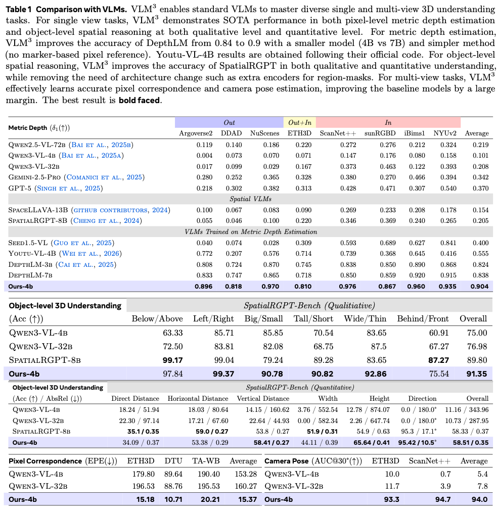
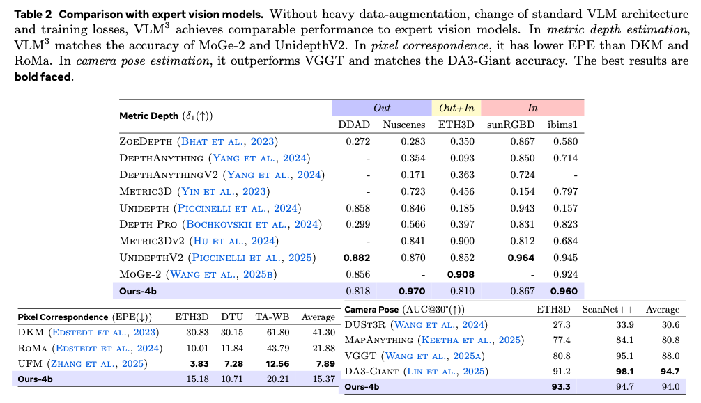

# [VLM³: Vision Language Models Are Native 3D Learners](https://arxiv.org/pdf/2605.30561)

[]([https://arxiv.org/abs/XXXX.XXXXX](https://arxiv.org/abs/2605.30561))

| Model      |                                               Coming Soon!                                                |
|:----:|:-------------------------------------------------------------------------------------------------:|

<div align=center>

</div>


## Summary

We show that **standard VLMs** are native 3D learners. We propose VLM³, which **without complex data augmentations and any architecture/loss change**, can make standard VLMs:
- Surpass SpatialRGPT on object-level 3D understanding (both qualitative and quantitative in SpatialRGPT-bench), without using extra encoders.
- Match [UnidepthV2](https://arxiv.org/abs/2502.20110) and [Moge-2](https://arxiv.org/pdf/2507.02546) on metric depth estimation, improving the accuracy of [DepthLM](https://github.com/facebookresearch/DepthLM_Official) from 0.84 to 0.9;
- Surpass [DKM](https://openaccess.thecvf.com/content/CVPR2023/papers/Edstedt_DKM_Dense_Kernelized_Feature_Matching_for_Geometry_Estimation_CVPR_2023_paper.pdf) and [RoMa](https://arxiv.org/pdf/2305.15404) for pixel correspondence estimation;
- Match [DepthAnything3](https://arxiv.org/abs/2511.10647) and surpass [VGGT](https://arxiv.org/pdf/2503.11651) for camera pose estimation;

VLM³ opens up a new paradigm for simple and scalable 3D learning. Now you dont need to spend a year designing:
- complex models with different backbones, prediction heads, routings.
- complex losses for different prediction heads, balancing weights for different losses
- complex data augmentations like image cropping, rotatin, translation, appearance augmentation etc.

**All you need to do is collect data, and scale the training with a standard VLM!**


Our findings provide a new perspective on what is and is not necessary for 3D vision:
- Large models, task-specific architectures, losses, data-augmentations, and even the regression formulation that sets the foundation of most SOTA 3D expert vision models, are all not necessary conditions for effective 3D learning.
- A generalist foundation model (VLM) with unified output domain (text) + data scaling are sufficient.


## Method Overview

Given the input images, VLM³ first resizes them so that the focal length is the same for all input images (e.g., 1000 pixels). This solves camera ambiguity without the need for adding extra VLM encoders/modules. To refer to an object or pixel, VLM³ simply uses text with the pixel range normalized (e.g., [0, 2000) or [0, 1000)) for both horizontal and vertical axes. This requires no architecture or marker rendering, and makes VLM³ much more flexible and scalable. Standard VLM architectures and text-based training (SFT) are used to train the model.

<div align=center>

</div>

## Results

<div align=center>

</div>

<div align=center>

</div>

<div align=center>

</div>


## Contact
Zhipeng Cai, Meta Inc, homepage: https://zhipengcai.github.io/, email: czptc2h at gmail dot com.

# Quickstart

Install transformers to do inference with our model.

    pip install transformers>=5.4.0

Since VLM³ maintain the architecture of the base model (Qwen3-vl-4B), we can call the model for inference the same as the original VLM.


### Using 🤗 Transformers to Chat

Here we show a code snippet to show you how to use the chat model with `transformers`:

```python
from transformers import AutoModelForImageTextToText, AutoProcessor

# default: Load the model on the available device(s)
model = AutoModelForImageTextToText.from_pretrained(
    "facebook/VLM3-depth", dtype="auto", device_map="auto"
)

processor = AutoProcessor.from_pretrained("facebook/VLM3-depth")

messages = [
    {
        "role": "user",
        "content": [
            {
                "type": "image",
                "image": "https://github.com/facebookresearch/VLM3/blob/main/sample_data/depth.jpeg",
            },
            {
                "type": "text",
                "text": (
                    f"Given this image, how far is the point at coordinates ({norm_x}, {norm_y}) "
                    "from the camera? The coordinates are in normalised [0, 2000] format relative "
                    "to image width and height. Output the thinking process in <think> </think> "
                    "and final answer (the meter number only, without the unit) in <answer> </answer> tags."
                ),
            },
        ],
    }
]

# Preparation for inference
inputs = processor.apply_chat_template(
    messages,
    tokenize=True,
    add_generation_prompt=True,
    return_dict=True,
    return_tensors="pt"
)
inputs = inputs.to(model.device)

# Inference: Generation of the output
generated_ids = model.generate(**inputs, max_new_tokens=128)
generated_ids_trimmed = [
    out_ids[len(in_ids) :] for in_ids, out_ids in zip(inputs.input_ids, generated_ids)
]
output_text = processor.batch_decode(
    generated_ids_trimmed, skip_special_tokens=True, clean_up_tokenization_spaces=False
)
print(output_text)
```

Please check this [Cookbook](https://github.com/facebookresearch/VLM3/blob/main/inference.ipynb) for detailed examples on how to use different checkpoints for different tasks.

## Citation

    @article{cai2026vlm3,
        title={VLM³: Vision Language Models Are Native 3D Learners},
        author={Cai, Zhipeng and Liu, Zhuang and Xiong, Yunyang and Liu, Zechun and Vikas, Chandra and Shi, Yangyang},
        journal={arXiv preprint arXiv:xxxx.yyyy},
        year={2026},
    }

## Related projects

This work is largely motivated by our previous project [DepthLM](https://github.com/facebookresearch/DepthLM_Official)

    @article{cai2025depthlm,
        title={DepthLM: Metric Depth from Vision Language Models},
        author={Cai, Zhipeng and Yeh, Ching-Feng and Hu, Xu and Liu, Zhuang and Meyer, Gregory and Lei, Xinjie and Zhao, Changsheng and Li, Shang-Wen and Chandra, Vikas and Shi, Yangyang},
        journal={arXiv preprint arXiv:2509.25413},
        year={2025},
    }

## License
VLM³ is FAIR CC-BY-NC licensed, as found in the LICENSE file.
